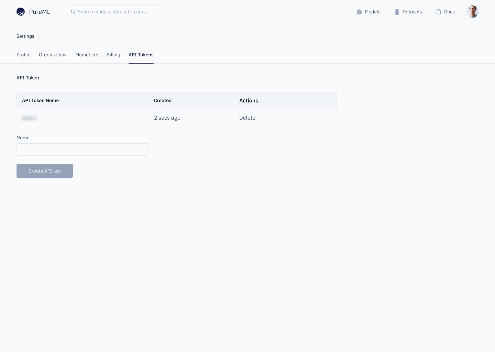
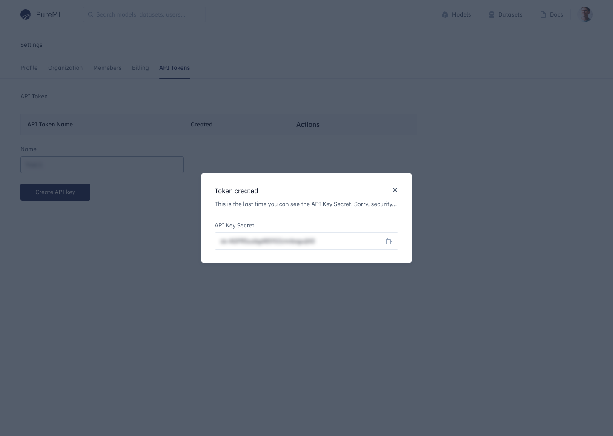

## New to SuperAlign?

If you're new to SuperAlign, you'll need to sign up for an account before you can start using the platform. CLI supports you to signup. You can do this using the `pureml` command line utility:

<CodeGroup>

```bash >_ Terminal
pureml auth signup
```

</CodeGroup>

This command will prompt you to enter your email, user handle, name, and password to create your SuperAlign account. Once you register your details successfully, you will receive a verification mail on registered email Id to verify and proceed for login.

## Sign In to start what you left

If you already have a SuperAlign account, you can log in using below method:

The `pureml` command line utility:

<CodeGroup>

```bash >_ Terminal
pureml auth login
```

</CodeGroup>

This command will prompt you to SuperAlign UI. Add your sign in credentials and you should see successful login on entering correct credentials.
Once you're logged in, you'll be able to view your dashboard.

<Info>
  Go to `https://app.superalign.ai/auth/sign-in` to sign in through your sign in
  credentials.
</Info>

### Using API Token

Go to API Token section in user account settings page on SuperAlign UI here (or using your self-hosted URL if any).



Create a new API Token. Copy the API Secret and save them somewhere safe. The API secret will never be shown again.



Go to your organization settings page to get your organization id. This will be useful in the next step.

<Tabs>
  <Tab title="SDK">
    While using the SDK after importing use the login function to login using API Token as below:

    ```python
    import pureml

    pureml.login(org_id="ENTER_YOUR_ORG_ID", api_key="ENTER_API_KEY")
    ```

  </Tab>
  <Tab title="CLI">
    You can use CLI to signin using API token by:

    <CodeGroup>

    ```bash >_ Terminal
    pureml auth login --api-key
    ```
    </CodeGroup>

  </Tab>
</Tabs>

<Card title="🎉 SuperAlign Up & running!" href="/core-concepts/model">
  Get ready to play with your data by starting with your first model.
</Card>
