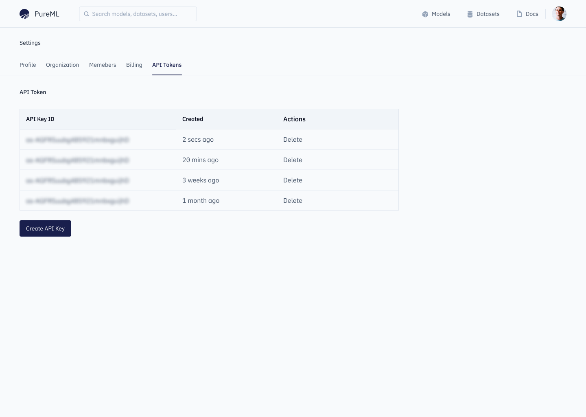
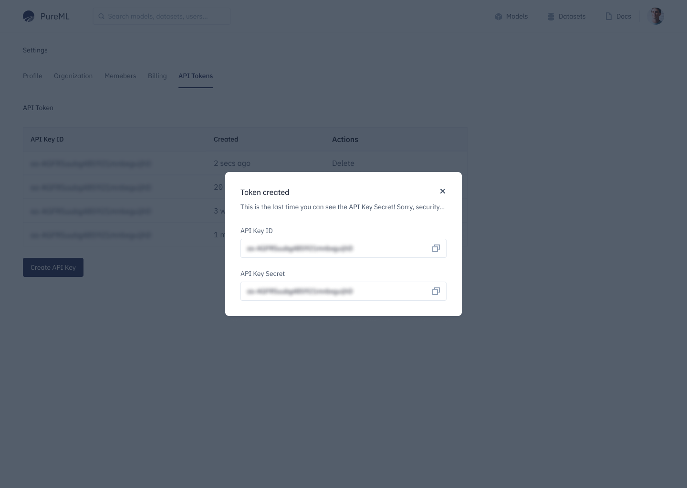

To get started with PureML, you'll need to install the PureML Python SDK. This SDK will allow you to work with the PureML platform, from creating your account to deploying your models.

To install PureML, simply run the following command:

<CodeGroup>

```bash >_ Terminal
pip3 install pureml
```

</CodeGroup>

> Make sure you have python version `>=3.8` and `<4.0>`.

## New to PureML?

If you're new to PureML, you'll need to sign up for an account before you can start using the platform. CLI supports you to signup. You can do this using the `pureml` command line utility:

<Tabs>
  <Tab title="Windows">
    Directly start using `pureml` command and its features:

    <CodeGroup>

    ```bash >_ Terminal
    pureml auth signup
    ```
    </CodeGroup>

    This command will prompt you to enter your email, user handle, name, and password to create your PureML account. Once you register your details successfully, you will receive a verification mail on registered email Id to verify and proceed for login.

  </Tab>
  <Tab title="Mac/Linux">
    1. Set environment variable to use PureML CLI.

    2. Run below command to start

    <CodeGroup>

    ```bash >_ Terminal
    pureml auth signup
    ```
    </CodeGroup>

    This command will prompt you to enter your email, user handle, name, and password to create your PureML account. Once you register your details successfully, you will receive a verification mail on registered email Id to verify and proceed for login.

  </Tab>
</Tabs>

## Sign In to start what you left

If you already have a PureML account, you can log in using below method:

The `pureml` command line utility:

<CodeGroup>

```bash >_ Terminal
pureml auth login
```

</CodeGroup>

This command will prompt you to PureML UI. Add your sign in credentials and you should see successful login on entering correct credentials.
Once you're logged in, you'll be able to view your datasets, models, and other assets using the PureML platform.

<Info>
  Go to `https://pureml.com/auth/signin` to sign in through your sign in
  credentials.
</Info>

### Using API Token

Go to API Token section in user account settings page on PureML UI here (or using your self-hosted URL if any).



Create a new API Token. Copy the API Id and API Secret and save them somewhere safe. The API secret will never be shown again.



Go to your organization settings page to get your organization id. This will be useful in the next step.

<Tabs>
  <Tab title="SDK">
    While using the SDK after importing use the login function to login using API Token as below:

    ```python
    import pureml

    pureml.login(org_id="ENTER_YOUR_ORG_ID", api_id="ENTER_API_ID", api_key="ENTER_API_KEY")
    ```

  </Tab>
  <Tab title="CLI">
    You can use CLI to signin using API token by:

    <CodeGroup>

    ```bash >_ Terminal
    pureml auth login --api-key
    ```
    </CodeGroup>

  </Tab>
</Tabs>

<Card title="🎉 PureML Up & running!" href="/core-concepts/model">
  Get ready to play with your data by starting with your first model.
</Card>
