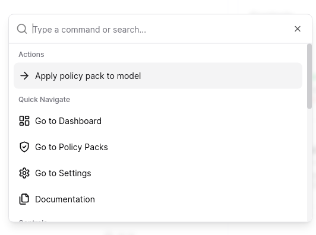
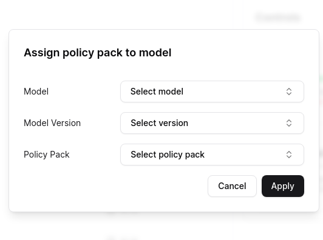
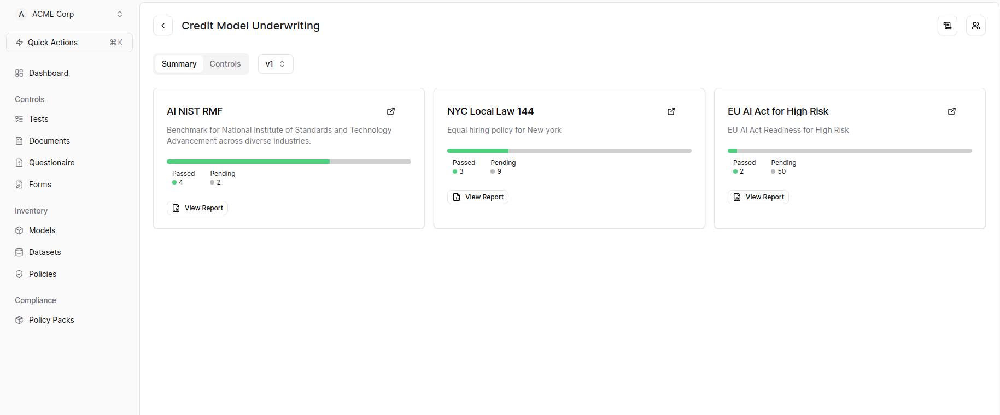

### Risk Generation

Refer to [Policy Section](./generate-risk) on to how to generate risk and add it to a version of a model.

SuperAlign supports dynamic policy application to a model from the Dashboard.  

---
title: Applying Policy Pack in SuperAlign
---

## Applying Policy Pack in SuperAlign

After logging into SuperAlign:

1. Click on the Quick Actions button located just below your Organization names. 

2. Select "Apply policy pack to model" from the dropdown menu. 

3. In the dialog box that appears:
   - Choose the desired Model.
   - Select the Model Version.
   - Pick the appropriate Policy Pack.
   - Click on the "Apply" button to proceed. 

4. Upon successful completion, you'll notice that the policy pack is applied to the model, and reports are generated and you'll redirected to the model summary page. 

