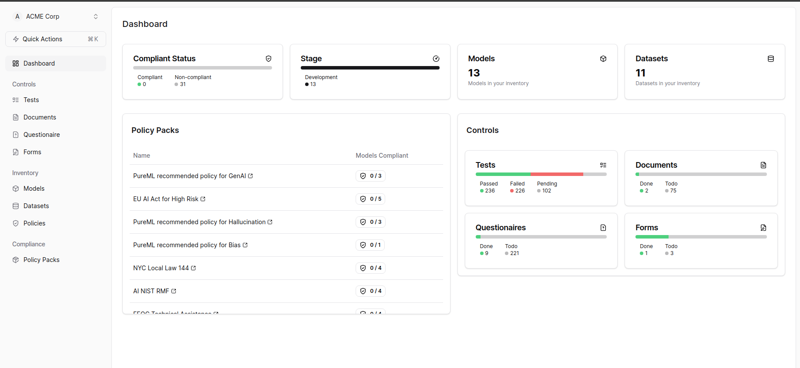
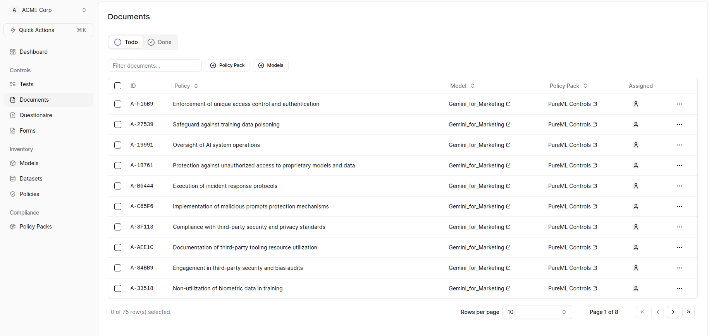
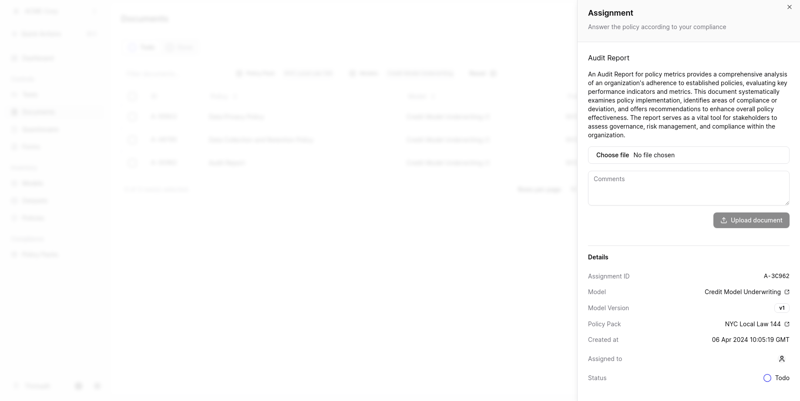

## Uploading Documents 

To apply required documents in SuperAlign, follow these steps:

1. Check the Controls tab and click on "Documents." 

2. In the Documents section, you can filter the documents using Policy Pack and Models. 

3. Click on the Policy name to open a new page.
4. On the new page, you can upload the file, add comments, and change the status as needed. 

<Info>
You can upload documents of type pdf
</Info>
