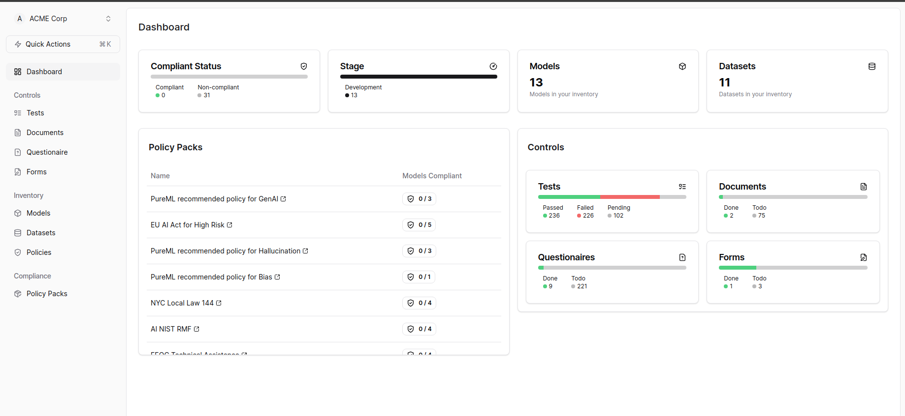

## Fill Forms

To fill out forms, follow the steps below:

1. Check the Controls tab and click on "Forms." 

2. In the Forms section, you can filter the forms using Policy Pack and Models. 

3. Click on the Policy name to open a new page.
4. On the new page, you can fill the form and save the changes. 

