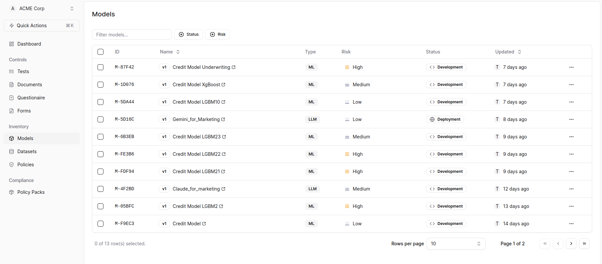
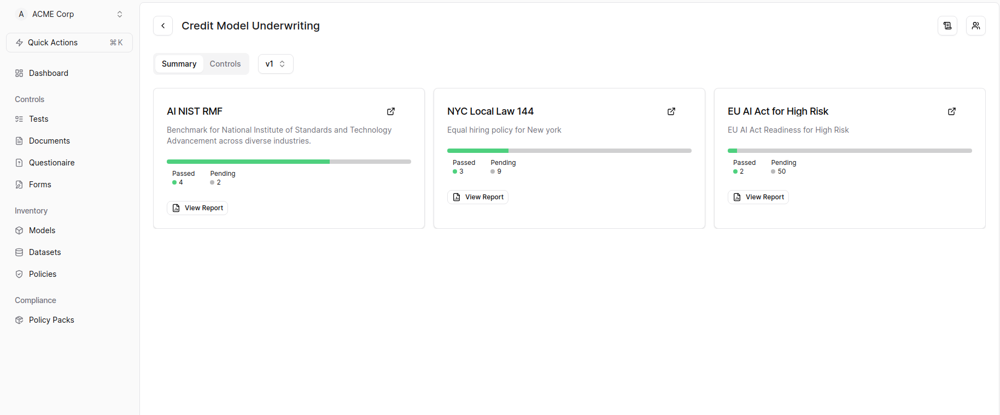
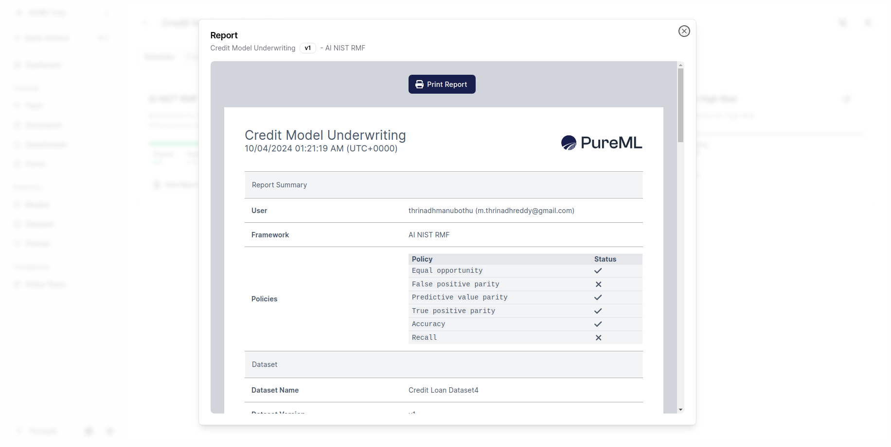

To generate reports for policies in PureML, follow these steps:

1. Select the models from the Inventory. 

2. This action will navigate you to the Model Summary Page.

<Info>
If model summary page is empty or the desired policy is not applied, please refer to the Apply Policy section. You can access the Apply Policy section [here](./apply-policy).
</Info>

3. On the Model Summary Page, click on the "View Report" button to view the generated report. 

4. The report will be displayed in a new tab. 

## Regenerating Reports

If your documents, questionnaires, or forms have been updated or changed and you have re-evaluated the metrics, you can regenerate the reports in the following way:

1. Navigate to Model Summary Page. 
2. Click on Controls tab 
3. Click on the "Regenerate Report" button. 
