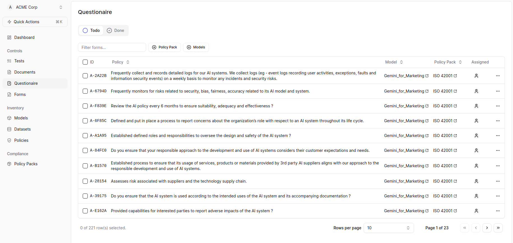
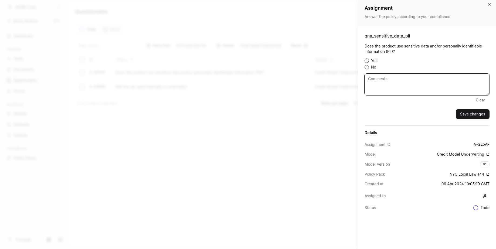

## Answering Questionnaire

To answer the questionnaire, follow the steps below:

1. Check the Controls tab and click on "Questionaire." 

2. In the Questionaire section, you can filter the questions using Policy Pack and Models. 

3. Click on the Policy name to open a new page.
4. On the new page, you can answer the question and save the changes. 

